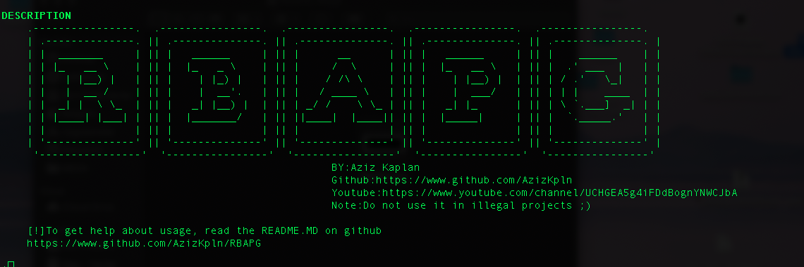

# RBAPG

# 

->RBAPG is the abbreviation of "Rule Based Attack Password Generator".

->This module is a wordlist generator module.

->You can generate randomly password(like crunch tool in kali linux) or you can generate a personalized password list.


# MODULE USAGE

* INSTALL The Module

> pip3 install RBAPG

* Call The Module

> import RBAPG

> RBAPG=RBAPG.RuleBasedAttackPasswordGenerator()

* Set the length of password

> RBAPG.setLengthOfGeneratedPassword(min2-max5)

* Set the wordlist content
> RBAPG.wordlist="name surname year etc."

* Generate the wordlist:
> RBAPG.generate_wordlist()

--------------------------------------------------------------------------------------------
# OPTIONAL STEPS:

* Aziz's combination algorithm. It's based on changing some certain indexes of password in the wordlist.

> RBAPG.CombineCozily()

* Tries the every combination of each password in the wordlist.
* Note:Not recommended for a huge content of wordlist.
> RBAPG.CombineTheWords()

# Example Usage
```
import RBAPG

RBAPG=RBAPG.RuleBasedAttackPasswordGenerator() #Set the class in a variable.

RBAPG.setLengthOfGeneratedPassword(4)           #Set the length of generated password(if you say 4,
                                                #this means the length of password can be a maximum of 4 strings long.)
                                                #Note:this function takes min 2 max 5 int value

RBAPG.setWordlistName("Aziz.txt")               #set a name for wordlist. If you leave it blank, default name will be wordlist.txt

RBAPG.wordlist="Aziz Kaplan 2001"               #set a content for wordlist. If you leave it blank, default content will be 'You haven't specified a wordlist'

#RBAPG.CombineCozily()                          #This function is optional. You don't have to write it in your codes but if you do,
                                                #it'll generate the password with combining a certain algoritgm.

#RBAPG.CombineTheWords()                        #This function is optional, tries the every combination of each word in the wordlist.
                                                #This function is not recommended for a huge content of wordlist.
                                                #Because it tries the every combination of passwords which wordlist contains.

RBAPG.generate_wordlist()                       #Generate the wordlist
```

# Example Script:
> https://github.com/AzizKpln/RBAPG-WORDLIST_GENERATOR
